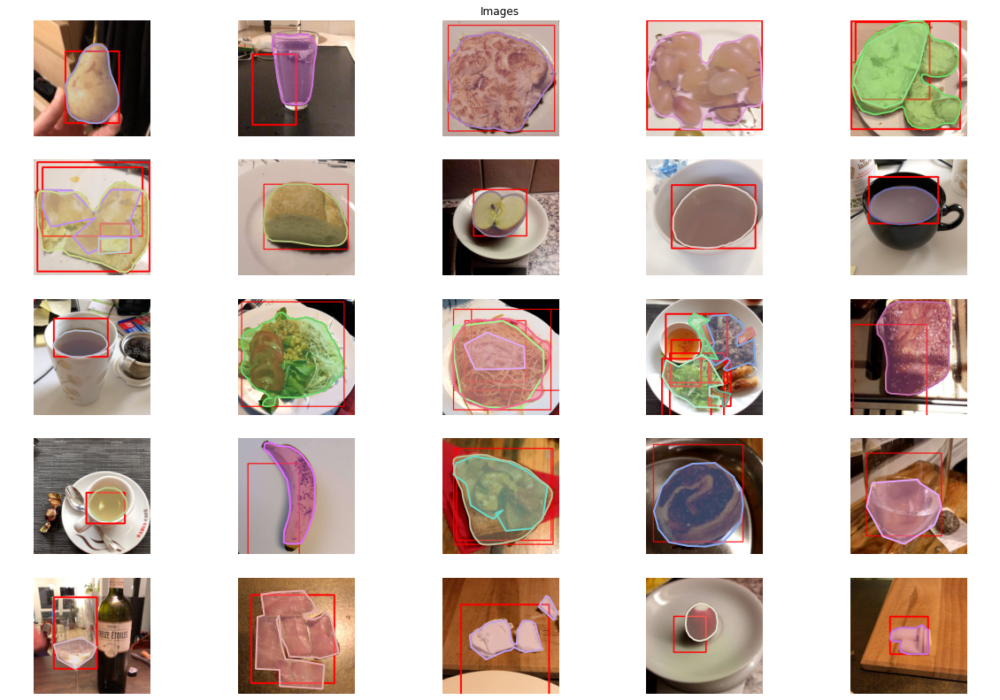

# Food Detection & Segmentation

# About

This repo containes my solutions for [AIcrowd Food Detection & Segmentation challange](https://www.aicrowd.com/challenges/food-recognition-challenge) in which we have to detect & segmentat over 273 different categories of food! 

# Motivation

The previous project i did for object detection use [Wheat Heads Detection using Detectron2](https://github.com/Shubhamai/wheat-detection), but there were only 1 class ( wheat heads ) and no segmentation mask, But in this challange, i mad over 200+ different classes with bluding box & segmentation. So, i decided to work on this project. 

# Tools Used

- [Detectron2](https://github.com/facebookresearch/detectron2)
- [Plotly](https://github.com/plotly/plotly.py)
There are the main libraries i used, there are many other's like pandas, numpy.

# Model

I used models form [Detectron2 Model Zoo](https://github.com/facebookresearch/detectron2/blob/master/MODEL_ZOO.md) and the model was Mask RCNN from COCO-Instance Segmentation.

# Dataset

We have a total of **24120 RGB images** with **2053 validation**, all in **MS-COCO format** and test set for now is same as validation ( debug mode ). 

# Getting Started

For now, I have actually a added [colab notebook](https://colab.research.google.com/drive/158H2d0Kdk223CBs9lOBwIHcxTut3Kyrc?usp=sharing) with ~ everything from dataset exploration to evaluation!

# License 
Distributed under the GNU General Public License v3.0. See LICENSE for more information.

# Contact
Shubhamai - [@Shubhamai](https://twitter.com/Shubhamai) - shubham.aiengineer@gmail.com

Website - [Shubhamai.com](http://shubhamai.com/)
